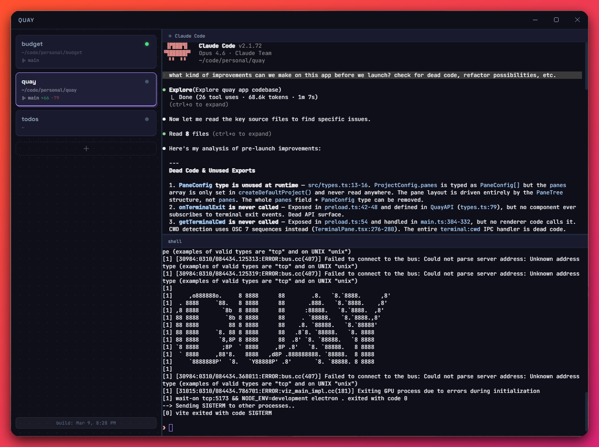

# Quay

A terminal multiplexer built for multi-repo workflows and AI coding agents.



## Download

Grab the latest release for your platform:

**[Download for macOS (.dmg)](https://github.com/matthewkturner/quay/releases/latest)** | **[Download for Windows (.exe)](https://github.com/matthewkturner/quay/releases/latest)**

> Quay auto-registers Claude Code hooks on first launch — no manual configuration needed.

## Why Quay?

I couldn't find a terminal multiplexer that worked well on WSL and also on macOS. I split my time between both, and existing tools were either platform-locked or didn't fit how I work — juggling multiple repos with Claude Code running in several of them at once.

If you've tried tmux with grids of Claude agents, you know the pain: constantly scanning panes to remember what each agent is doing, tweaking your statusline, losing context when you switch projects. Quay gives you project-based tabs, persistent layouts, and real-time status indicators — so you can see at a glance which agent is busy, needs approval, or is waiting for your next prompt.

This isn't trying to be the fastest, most native, Rust-powered terminal app. It's a practical tool I built to solve my own workflow pain points. It runs on Electron because that's what let me ship something that works on both platforms quickly. If it's useful to you too, great.

## Features

- **Project-based terminals** — group panes by project with named tabs, paths, and git context
- **Claude Code integration** — real-time status detection (busy, waiting, needs attention) per pane via Claude's hook system
- **Auto-resume sessions** — Claude panes automatically run `claude --continue` on launch, picking up right where you left off
- **Persistent workspaces** — layouts, splits, and project configs auto-save and restore across sessions
- **Git status in sidebar** — branch name, additions/deletions, dirty state at a glance
- **Flexible split panes** — horizontal and vertical splits with draggable dividers
- **Keyboard shortcuts** — `Cmd+1-9` to switch projects, `Cmd+T` to add a project, `Cmd+,` for settings
- **Dark and light themes** — with configurable font size
- **Cross-platform** — macOS and Windows (WSL)

## Claude Code Status Indicators

Quay hooks into Claude Code's event system to show per-pane status in the sidebar:

- **Gray** — idle, shell waiting for input
- **Blue** (pulsing) — Claude is working
- **Green** — long-running process (dev server, watcher)
- **Yellow** (ringing) — Claude needs attention (approval, input, error)

Status updates happen in real-time via Claude Code hooks — no polling or regex hacking.

## Getting Started

1. Download and install from the [releases page](https://github.com/matthewkturner/quay/releases/latest)
2. Launch Quay
3. Click **+** to add a project — give it a name and point it at a repo
4. Split panes with the toolbar buttons, right-click, or keyboard shortcuts

Quay registers Claude Code hooks automatically on startup. Any terminal where you run `claude` will report status back to the sidebar.

<details>
<summary><strong>Building from Source</strong></summary>

### Prerequisites

- Node.js 20+
- Python 3 with `setuptools` (`pip3 install setuptools` or `brew install python-setuptools` on macOS)
- Xcode Command Line Tools on macOS (`xcode-select --install`)

### Development

```bash
git clone https://github.com/matthewkturner/quay.git
cd quay
npm install
npm run dev
```

### Package for Distribution

```bash
# macOS
npm run pack:mac

# Windows
npm run pack:win
```

Output goes to `release/`.

### Architecture

Quay is an Electron app with a React frontend and node-pty backend.

```
┌─────────────────────────────────────────────────┐
│ Electron Main Process                           │
│  ├─ node-pty (spawn shells, manage terminals)   │
│  ├─ Git status polling (branch, diff stats)     │
│  ├─ Claude hook server (HTTP, localhost)         │
│  └─ Workspace persistence (auto-save/load)      │
├─────────────────────────────────────────────────┤
│ Renderer (React + xterm.js)                     │
│  ├─ Sidebar (projects, git info, status dots)   │
│  ├─ PaneLayout (recursive split tree)           │
│  └─ TerminalPane (xterm + status detection)     │
└─────────────────────────────────────────────────┘
```

### Tech Stack

- [Electron](https://www.electronjs.org/) — desktop app framework
- [React](https://react.dev/) — UI
- [xterm.js](https://xtermjs.org/) — terminal emulator
- [node-pty](https://github.com/microsoft/node-pty) — pseudo-terminal management
- [Vite](https://vite.dev/) — build tooling
- [TypeScript](https://www.typescriptlang.org/) — type safety

</details>

## License

MIT
